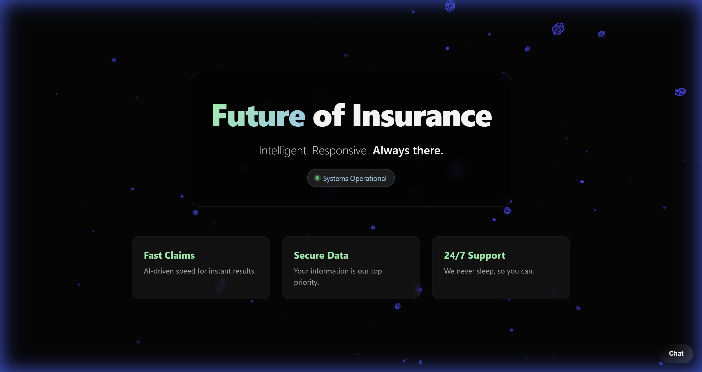
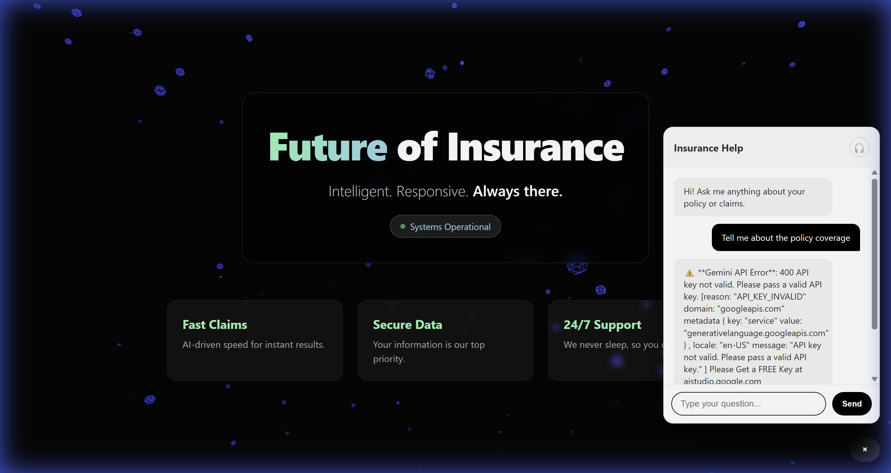

# 🛡️ Insurance RAG Chatbot (GenAI)


A high-performance **Retrieval-Augmented Generation (RAG)** chatbot specifically engineered for insurance agencies. This application leverages the power of **Google's Gemini Pro** for reasoning and **FAISS** for vector search to provide accurate, context-aware answers derived strictly from your policy documents.

It features a premium, animated **React Frontend** with 3D visualizations and a robust **FastAPI Backend**.

## 🚀 Features

-   **📄 Intelligent PDF Ingestion**: Automatically parses, chunks, and indexes complex PDF policy documents.
-   **🧠 Advanced RAG Architecture**: Uses vector embeddings (`models/embedding-001`) to retrieve the most relevant clauses for every query.
-   **💬 Context-Aware Conversations**: Maintains conversation history for natural, follow-up Q&A.
-   **📚 Transparent Citations**: Every answer provides specific "Source" snippets, building user trust by showing exactly where the information came from.
-   **🎧 Human Handoff**: Detects when better support is needed and offers a seamless transition to human agents.
-   **✨ Premium 3D UI**: Built with `React Three Fiber` for a stunning, modern user experience.

---

## 🏗️ Architecture

The system consists of two main microservices:

1.  **Backend (FastAPI)**:
    -   Handles document processing (PDF → Text → Chunks → Embeddings).
    -   Manages the **FAISS** vector database for sub-millisecond similarity search.
    -   Orchestrates the LLM interaction with **Google Gemini Pro**.

2.  **Frontend (React + Vite)**:
    -   A lightweight, reactive UI.
    -   Communicates with the backend via RESTful endpoints.
    -   Renders real-time chat updates and 3D background elements.

---

## 🛠️ Technology Stack

-   **Language**: Python 3.11+, JavaScript (ES6+)
-   **Frameworks**: FastAPI, Uvicorn, React, Vite
-   **AI & ML**: 
    -   LLM: `gemini-pro`
    -   Embeddings: `models/embedding-001`
    -   Vector Store: `faiss-cpu`
-   **Libraries**: `langchain` (concepts), `pypdf`, `numpy`, `framer-motion`, `@react-three/fiber`

---

## ⚡ Getting Started

### Prerequisites
-   Python 3.11 or higher
-   Node.js (v18+) & npm
-   A **Google Cloud API Key** (for Gemini)

### 1. Clone the Repository
```bash
git clone https://github.com/AnmollCodes/insurance-rag-chatbot.git
cd insurance-rag-chatbot
```

### 2. Backend Setup
Navigate to the backend directory and set up the Python environment.

```bash
cd backend
python -m venv .venv
# Windows
.venv\Scripts\activate
# Mac/Linux
source .venv/bin/activate

pip install -r requirements.txt
```

**Configuration**:
Create a `.env` file in the `backend/` directory:
```ini
GEMINI_API_KEY=your_google_api_key_here
```

**Start the Server**:
```bash
python -m uvicorn main:app --reload --port 8000
```

**Ingest Data**:
Run the ingestion command to parse your `knowledge.pdf` (ensure the file exists in `backend/data/`):
```bash
# Using cURL
curl -X POST http://localhost:8000/ingest

# Or standard Windows cmd
curl -X POST http://localhost:8000/ingest
```

### 3. Frontend Setup
Open a new terminal and navigate to the frontend directory.

```bash
cd frontend
npm install
npm run dev
```

Visit `http://localhost:5173` to interact with the chatbot!

---

## 📸 Gallery

<p align="center">
  
  
</p>

## 📂 Project Structure

```bash
insurance-rag-chatbot/
├── backend/
│   ├── data/            # Stores knowledge.pdf and FAISS index
│   ├── rag/             # Core RAG logic (chunking, embedding, answering)
│   ├── main.py          # FastAPI entry point
│   └── requirements.txt
├── frontend/
│   ├── src/
│   │   ├── components/  # ChatWidget, Experience (3D)
│   │   └── App.jsx
│   └── package.json
└── README.md
```

## 🤝 Contributing
Contributions are welcome! Please fork the repository and submit a pull request for any enhancements.

## 📄 License
This project is licensed under the MIT License.
